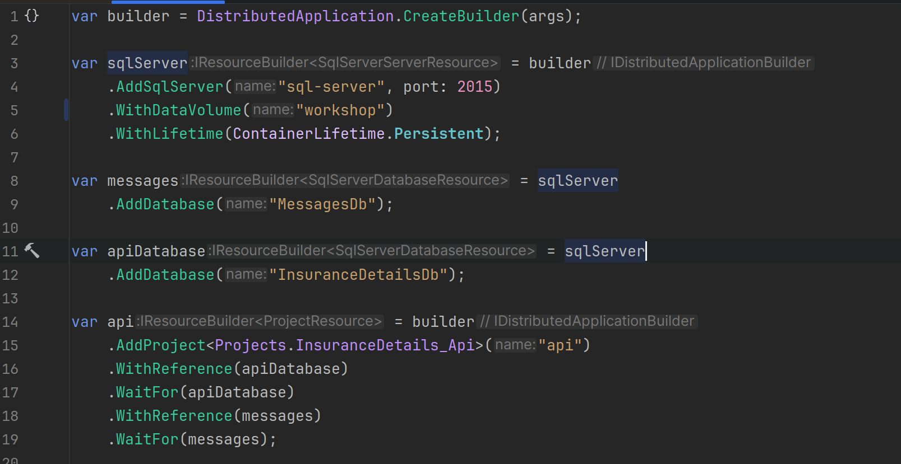

# ~~.NET~~ Aspire

## Rick Neeft
---

# ~~.NET~~ Aspire

**A new stack for building cloud-native apps in .NET**

- Released by Microsoft (2024)
- *Simplifies* microservices development
- Optimized for **local** development
- Includes service discovery, telemetry, orchestration

---

# What's in .NET Aspire?

- **AppHost** – your entry point & orchestrator
- **Projects** – Web APIs, Workers, Blazor, etc.
- **Components** – Redis, PostgreSQL, etc. with zero config
- **Observability** – built-in OpenTelemetry support
- **Service Discovery** – auto-connect microservices

---

---

# Dev Experience

- Works with Docker, containers, and Azure
- Built-in dashboard to visualize running services
- Use Aspire during development, deploy anywhere

---

# Ideal Use Cases

- Microservices architecture
- Internal developer platforms
- Event-driven apps and APIs
- ~~Teams building with .NET 8+~~

---

# What we will do
- Run SQL server with Aspire
- Add the projects
- Add the migrations 

---

# Lets dive in!