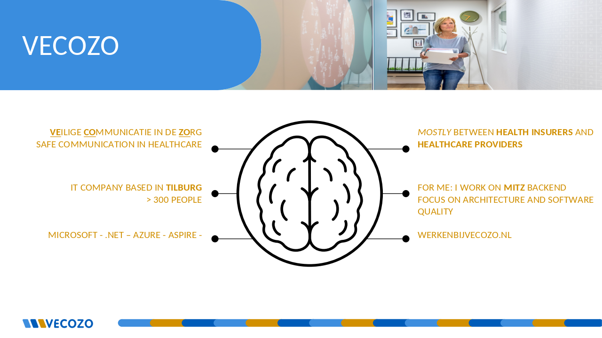
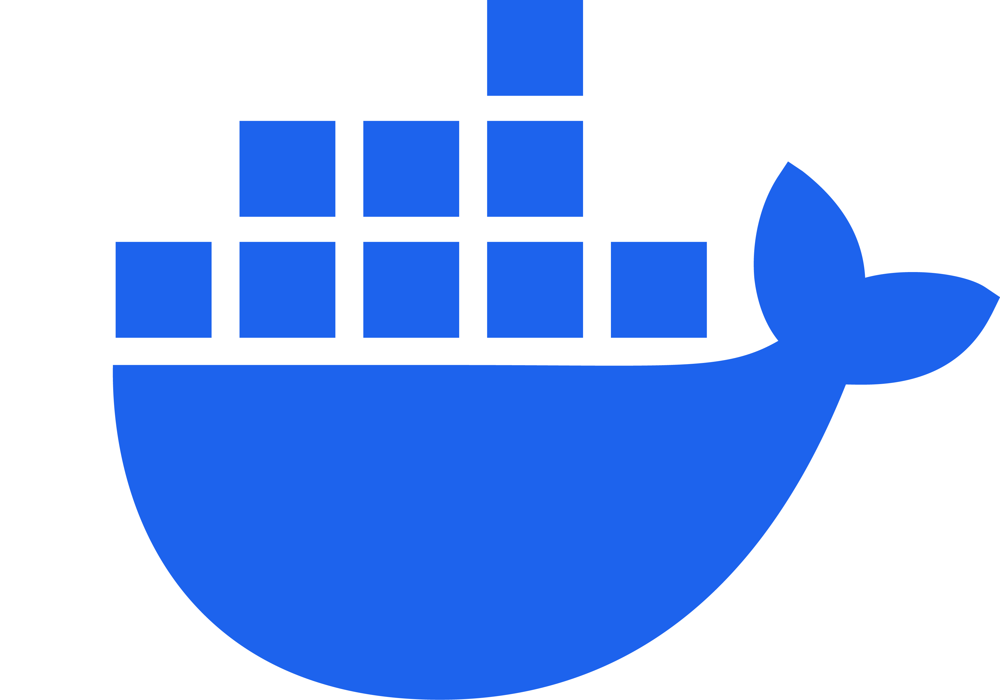
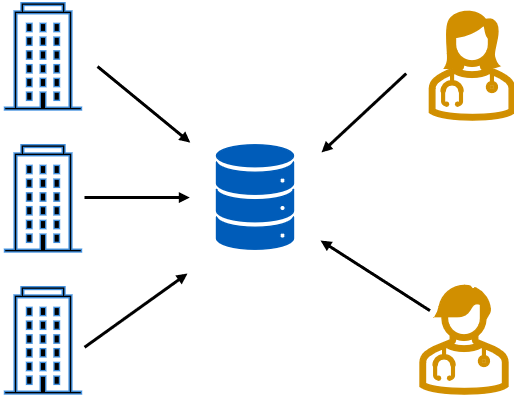

# Microservices & Containerisation met .NET Aspire
 
---


# Rick Neeft

## Developer @VECOZO

<i class="bi bi-linkedin"></i> LinkedIn: [rneeft](https://linkedin.com/in/rneeft)
<i class="bi bi-browser-chrome"></i> Blog: [rickneeft.dev](https://www.rickneeft.dev)
<i class="bi bi-github"></i> GitHub: [rneeft](https://github.com/rneeft)

---



---

# Agenda

- Gymnastics
- Theory
- Introduction
- Case
- Give it a go
- .NET Aspire
- Identity Provider
- Messaging

---

# Gymnastics
- Who is using Windows

---

# Gymnastics
- Windows User: Who knows what WSL is?

---

# Gymnastics
- Who is using Linux

---

# Gymnastics
- Who is using MacOS

---

# Gymnastics
- Who is using dotnet for programming?

---

# Gymnastics
- Who is using Java for programming?

---

# Gymnastics
- Who is using something else for programming?

---

# Gymnastics
- Who knows what Docker is?

---

# Gymnastics
- Who knows what Virtual machines are?


---

# Microservices & Containerisation met .NET Aspire

### From Monoliths to Modern Deployment

The theory, just a little bit, I promise

---

# In the early days: Monoliths


**What is a monolith?**

- Single, unified codebase
- All components tightly coupled

**Challenges:**
- Difficult to scale specific parts
- Risky deployments (entire app goes down)
- Long development and release cycles

<sub><sup><sup><sup>Image from 2001: A Space Odyssey</sup></sup></sup></sub>

---

# The Rise of Microservices


**Why Microservices?**
- Decouple components for flexibility
- Faster independent deployments
- Technology diversity per service

**Key Principles:**
- Single Responsibility per service
- Communication over APIs or messaging
- Independent scaling

<sub><sup><sup><sup>Photo by Wolfgang Weiser: https://www.pexels.com/photo/container-ships-at-busy-hamburg-port-31637364/</sup></sup></sup></sub>

---

# Deploying Microservices

**Key Features:**
- Each service is deployed **independently**
- Uses **containers** (e.g., Docker)
- Orchestrated by platforms like **Kubernetes**
- Updates via **CI/CD pipelines**

**Common Stack:**
- Docker → Package
- Kubernetes → Deploy & Scale
- CI/CD → Automate release (e.g., GitHub Actions, GitLab, Jenkins)

---

# What will we do today

- Docker (compose) deployment
- Use .NET Aspire

---

# Docker


- Platform for developing, shipping and running application
- Package with loosely isolated environments: containers
- Containers are 'lightweight' and portable.

---
# How? Dockerfile

- Like a Recipe
- Describes how to build an docker image
- Docker image: read-only instructions to create the container

---

# Dockerfile - Example
```dockerfile
FROM mcr.microsoft.com/dotnet/aspnet:9.0 AS base
USER $APP_UID
WORKDIR /app
EXPOSE 8080
EXPOSE 8081

FROM mcr.microsoft.com/dotnet/sdk:9.0 AS build
ARG BUILD_CONFIGURATION=Release
WORKDIR /src
COPY ["src/InsuranceDetails.Api/InsuranceDetails.Api.csproj", "src/InsuranceDetails.Api/"]
RUN dotnet restore "src/InsuranceDetails.Api/InsuranceDetails.Api.csproj"
COPY . .
WORKDIR "/src/src/InsuranceDetails.Api"
RUN dotnet build "./InsuranceDetails.Api.csproj" -c $BUILD_CONFIGURATION -o /app/build

FROM build AS publish
ARG BUILD_CONFIGURATION=Release
RUN dotnet publish "./InsuranceDetails.Api.csproj" -c $BUILD_CONFIGURATION -o /app/publish /p:UseAppHost=false

FROM base AS final
WORKDIR /app
COPY --from=publish /app/publish .
ENTRYPOINT ["dotnet", "InsuranceDetails.Api.dll"]
```

---
# Docker compose

- If the **dockerfile** is a recipe then **Compose** is your menu

---

# Docker compose - Example

```yml
services:
  sqlserver:
    image: mcr.microsoft.com/mssql/server:2022-latest
    container_name: mssql
    environment:
      SA_PASSWORD: YourStrongPassword123!
      ACCEPT_EULA: "Y"
    ports:
      - "1433:1433"
    volumes:
      - sqlserver-data:/var/opt/mssql

  insurancedetails-api:
    build:
      context: .
      dockerfile: src/InsuranceDetails.Api/Dockerfile
    container_name: insurancedetails-api
    environment:
      ASPNETCORE_ENVIRONMENT: Development
      ConnectionStrings__InsuranceDetailsDb: "Server=sqlserver;Database=InsuranceDetailsDb;User Id=sa;Password=YourStrongPassword123!;TrustServerCertificate=True;"
    ports:
      - "8080:8080"
      - "8081:8081"
    depends_on:
      - sqlserver

volumes:
  sqlserver-data:
```

---

# Theory - Questions?

---

# 🇳🇱 Dutch Healthcare System

- Every citizen has **basic health insurance** (*Basisverzekering*)
- You can add **supplementary insurance** (*Aanvullende verzekering*)
  - e.g. dental care, physiotherapy, travel vaccinations
- **Health insurers** = private companies (e.g. Menzis, CZ)
- **Health providers** = GPs, hospitals, specialists


##### But who is insured where and for what?

---

# First product (dienst) of VECOZO
COV - Insurance Data Check (Controle op Verzekeringsgegevens)

---

# COV - Controle op Verzekeringsgegevens



---

# Questions?
So far

---

# Lets go!!

```
https://www.rickneeft.dev/aspire-course-site/
```

```
https://github.com/rneeft/workshop-avans-2-juni
```
