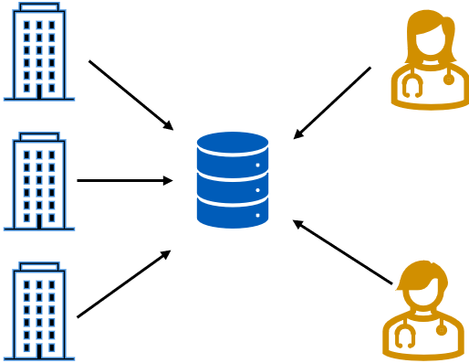

# Microservices & Containerisation met .NET Aspire
 
---


# Rick Neeft

## Developer @VECOZO

<i class="bi bi-linkedin"></i> LinkedIn: [rneeft](https://linkedin.com/in/rneeft)
<i class="bi bi-github"></i> Blog: [rickneeft.dev](https://www.rickneeft.dev)
<i class="bi bi-browser-chrome"></i> GitHub: [rneeft](https://github.com/rneeft)

---

# VECOZO
> TODO

---

# Agenda

- Gymnastics
- Theory
- Introduction
- Case
- Give it a go
- .NET Aspire
- Identity Provider
- Messaging

---

# Gymnastics
- Who is using Windows

---

# Gymnastics
- Windows User: Who knows what WSL is?

---

# Gymnastics
- Who is using Linux

---

# Gymnastics
- Who is using MacOS

---

# Gymnastics
- Who is using dotnet for programming?

---

# Gymnastics
- Who is using Java for programming?

---

# Gymnastics
- Who is using something else for programming?

---

# Gymnastics
- Who knows what Docker is?

---

# Gymnastics
- Who knows what Virtual machines are?

---

# Theory
A bit, don't worry

---

# Deployment of software

> TODO Add timeline 

---

> TODO Remove

# In the early days

- Real hardware - Bare metal
- Apache server / Internet Information Services (IIS)

---
> TODO Remove

# Virtual machines

- (multiple) virtual OS on top of a OS -> hypervisor 
- Real hardware virtualised

---

# Today Docker


- Platform for developing, shipping and running application
- Package with loosely isolated environments: containers
- Containers are 'lightweight' and portable.
- IS not virtual machine

---
# Dockerfile

- Recipe
- Describes how to build an docker image
- Docker image: read-only instructions to create the container
---

# Dockerfile - Example
```dockerfile
FROM mcr.microsoft.com/dotnet/aspnet:9.0 AS base
USER $APP_UID
WORKDIR /app
EXPOSE 8080
EXPOSE 8081

FROM mcr.microsoft.com/dotnet/sdk:9.0 AS build
ARG BUILD_CONFIGURATION=Release
WORKDIR /src
COPY ["src/InsuranceDetails.Api/InsuranceDetails.Api.csproj", "src/InsuranceDetails.Api/"]
RUN dotnet restore "src/InsuranceDetails.Api/InsuranceDetails.Api.csproj"
COPY . .
WORKDIR "/src/src/InsuranceDetails.Api"
RUN dotnet build "./InsuranceDetails.Api.csproj" -c $BUILD_CONFIGURATION -o /app/build

FROM build AS publish
ARG BUILD_CONFIGURATION=Release
RUN dotnet publish "./InsuranceDetails.Api.csproj" -c $BUILD_CONFIGURATION -o /app/publish /p:UseAppHost=false

FROM base AS final
WORKDIR /app
COPY --from=publish /app/publish .
ENTRYPOINT ["dotnet", "InsuranceDetails.Api.dll"]
```

---
# Docker compose

- If docker file is recipe -> Compose is your menu

---

# Docker compose - Example
> TODO: 1433 default SQL server
> TODO: Latest SQL server to speed up Aspire later on

```yml
services:
  sqlserver:
    image: mcr.microsoft.com/mssql/server:2019-latest
    container_name: mssql
    environment:
      SA_PASSWORD: YourStrongPassword123!
      ACCEPT_EULA: "Y"
    ports:
      - "1433:1433"
    volumes:
      - sqlserver-data:/var/opt/mssql

  insurancedetails-api:
    build:
      context: .
      dockerfile: src/InsuranceDetails.Api/Dockerfile
    container_name: insurancedetails-api
    environment:
      ASPNETCORE_ENVIRONMENT: Development
      ConnectionStrings__InsuranceDetailsDb: "Server=sqlserver;Database=InsuranceDetailsDb;User Id=sa;Password=YourStrongPassword123!;TrustServerCertificate=True;"
    ports:
      - "8080:8080"
      - "8081:8081"
    depends_on:
      - sqlserver

volumes:
  sqlserver-data:
```

---

# Theory - Questions?

---

# The case for today
> TODO: Explain Health insurance
> TODO: Explain the problem

---

# COV - Controle op Verzekeringsgegevens



---

# Questions?
So far?

---

# Lets go!!

```
https://www.rickneeft.dev/aspire-course-site/
```

```
https://github.com/rneeft/workshop-avans-2-juni
```